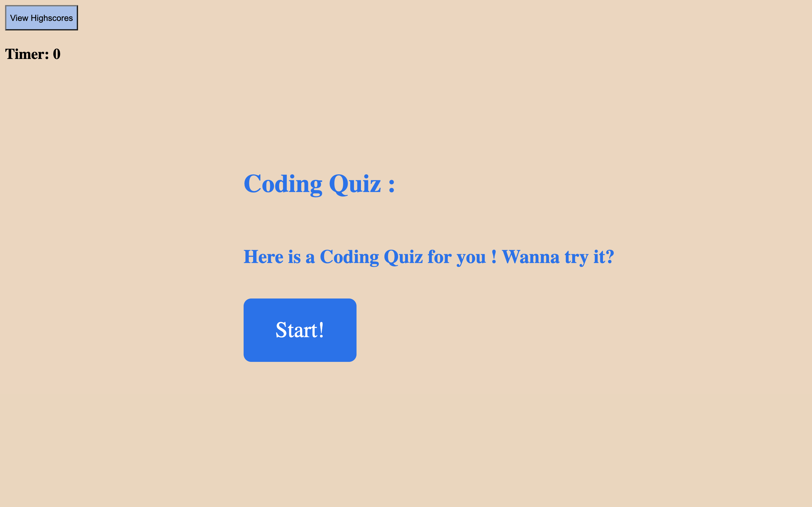

# My_code_quiz_website
A quiz website based on Javascript,HTML,CSS.
Build a timed coding quiz with multiple-choice questions. This app will run in the browser, and will feature dynamically updated HTML and CSS powered by JavaScript code that you write. It will have a clean, polished, and responsive user interface.
https://zst199394.github.io/My_code_quiz_website/.
https://github.com/zst199394/My_code_quiz_website

# Code Quiz challenge:
As we proceed in our journey to becoming a full-stack web developer, it’s likely that we’ll be asked to complete a coding assessment, perhaps as part of an interview process. A typical coding assessment is a combination of multiple-choice questions and interactive coding challenges. 

# Develop Purpose:
Coding your own JavaScript quiz is also a fantastic learning exercise. It teaches you how to deal with events, manipulate the DOM, handle user input, give feedback to the user and keep track of their score (for example, using client-side storage). And when you have a basic quiz up and running, there are a whole bunch of possibilities to add more advanced functionality, such as pagination. 
In this project,I am going to create a multi-step JavaScript quiz which you’ll be able to adapt to your needs and add to your own site. If you’d like to see what we’ll be ending up with, you can skip ahead and see the working quiz.
https://zst199394.github.io/My_code_quiz_website/.

## User Story

```
AS A coding boot camp student
I WANT to take a timed quiz on JavaScript fundamentals that stores high scores
SO THAT I can gauge my progress compared to my peers
```

## Acceptance Criteria

```
GIVEN I am taking a code quiz
WHEN I click the start button
THEN a timer starts and I am presented with a question
WHEN I answer a question
THEN I am presented with another question
WHEN I answer a question incorrectly
THEN time is subtracted from the clock
WHEN all questions are answered or the timer reaches 0
THEN the game is over
WHEN the game is over
THEN I can save my initials and score